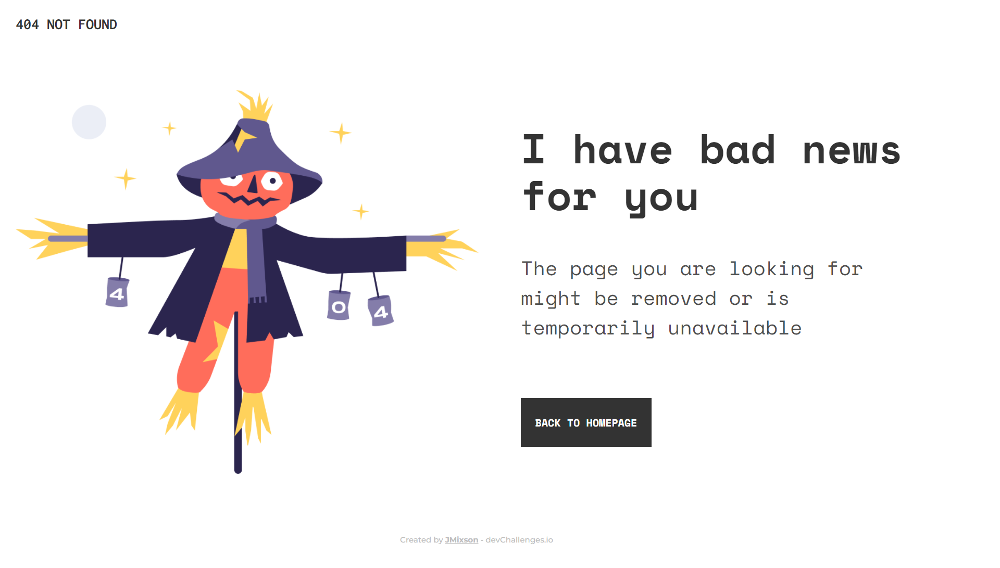
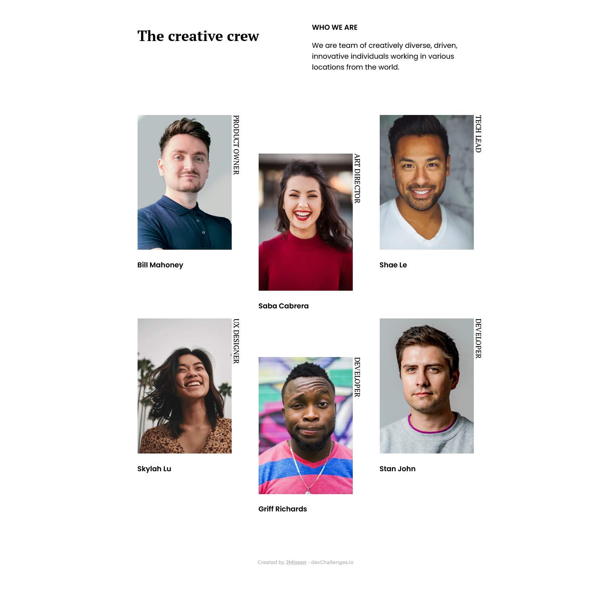
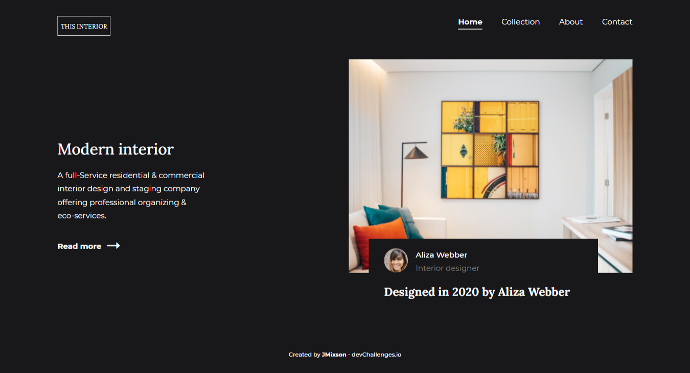
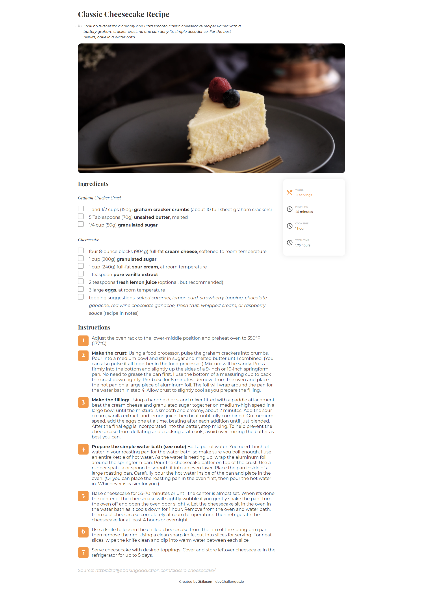
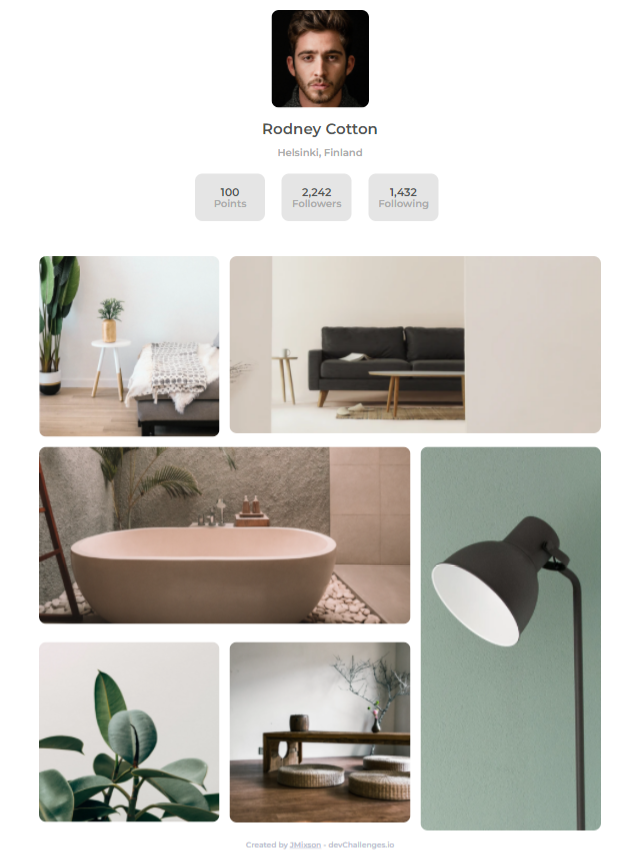

# devchallenges

Challenges from devChallenges.

## Completed Challenges

- Responsive
  - [404 Page](#404-page)
  - [Team Page](#team-page)
  - [Interior Consultant](#interior-consultant)
  - [Recipe Page](#recipe-page)
  - [My Gallery](#my-gallery)

### 404 Page

  <h4>
    <a href="https://jmixson-404-page.netlify.app/">
      Demo
    </a>
     | 
    <a href="https://devchallenges.io/solutions/oA11T1ty9lJjSDlblQta">
      Solution
    </a>
     | 
    <a href="https://devchallenges.io/challenges/wBunSb7FPrIepJZAg0sY">
      Challenge
    </a>
     | 
    <a href="https://github.com/JMixson/devchallenges/tree/main/responsive/404-not-found">
      GitHub
    </a>
  </h4>

#### The challenge

Create a 404 not found page following the design. The page should be responsive.

#### Built with

- HTML
- CSS
- CSS Grid

---

### Team Page

  <h4>
    <a href="https://jmixson-my-team-page.netlify.app/">
      Demo
    </a>
     | 
    <a href="https://devchallenges.io/solutions/FcOwVWYMsM6lSYpF5Ih1">
      Solution
    </a>
     | 
    <a href="https://devchallenges.io/challenges/hhmesazsqgKXrTkYkt0U">
      Challenge
    </a>
     | 
    <a href="https://github.com/JMixson/devchallenges/blob/main/responsive/my-team-page/README.md">
      GitHub
    </a>
  </h4>

#### The challenge

Create the team page following the design. The page should be responsive.

#### Built with

- HTML
- CSS (Flexbox & Grid)

---

### Interior Consultant

  <h4>
    <a href="https://jmixson-interior-consultant.netlify.app/">
      Demo
    </a>
     | 
    <a href="https://devchallenges.io/solutions/7gDdig5zWG4bXHHdaVUl">
      Solution
    </a>
     | 
    <a href="https://devchallenges.io/challenges/Jymh2b2FyebRTUljkNcb">
      Challenge
    </a>
     | 
    <a href="https://github.com/JMixson/devchallenges/tree/main/responsive/interior-consultant">
      GitHub
    </a>
  </h4>

#### The challenge

Build an application which:

- Follows the given design
- On mobile, the navigation collapses
- On mobile, the hamburger menu can be selected to see the navigation

#### Built with

- HTML
- CSS Grid & Flexbox
- SASS
- Javascript

---

### Interior Consultant

  <h4>
    <a href="https://jmixson-recipe-page.netlify.app/">
      Demo
    </a>
     | 
    <a href="https://devchallenges.io/solutions/gfn5BDuxdbDnLd319Y8c">
      Solution
    </a>
     | 
    <a href="https://devchallenges.io/challenges/OEKdUZ6xs0h99C38XVht">
      Challenge
    </a>
     | 
    <a href="https://github.com/JMixson/devchallenges/tree/main/responsive/recipe-page">
      GitHub
    </a>
  </h4>

#### The challenge

Build an application to complete the following user stories:

- Recipe with ingredients and instructions displayed
- Checkboxes for the ingredients can be selected
- Can see the number of servings and baking times

#### Built with

- HTML
- CSS Grid & Flexbox
- SASS

---

### My Gallery

  <h4>
    <a href="https://jmixson-my-gallery.netlify.app/">
      Demo
    </a>
     | 
    <a href="https://devchallenges.io/solutions/iBNgFpeX9vVMngSarifU">
      Solution
    </a>
     | 
    <a href="https://devchallenges.io/challenges/gcbWLxG6wdennelX7b8I">
      Challenge
    </a>
     | 
    <a href="https://github.com/JMixson/devchallenges/tree/main/responsive/my-gallery">
      GitHub
    </a>
  </h4>

#### The challenge

Build an application which:

- Follows the given design

#### Built with

- HTML
- CSS Grid & Flexbox
- SASS
