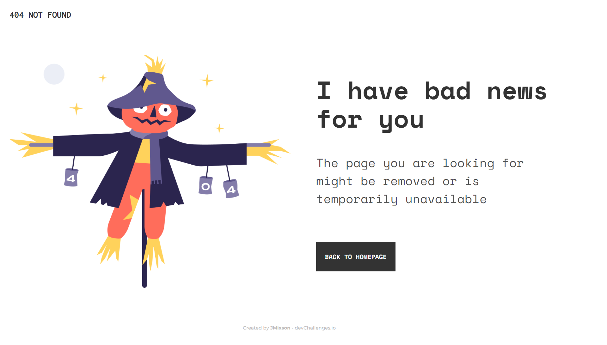
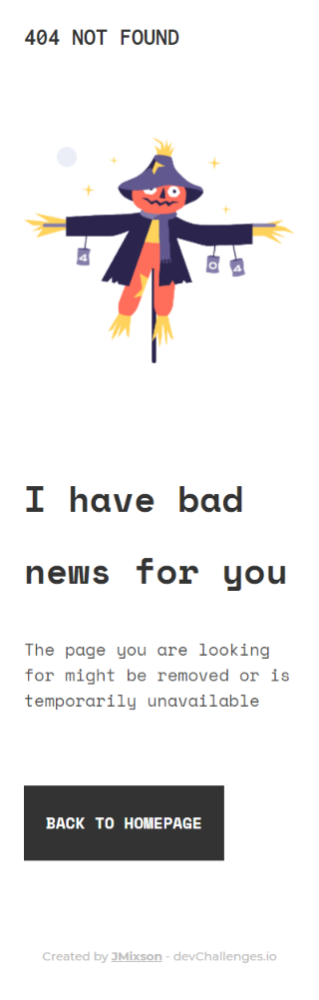

<h1 align="center">404 Page</h1>

   Solution for a challenge from  <a href="http://devchallenges.io" target="_blank">Devchallenges.io</a>.

  <h3>
    <a href="https://jmixson-404-page.netlify.app/">
      Demo
    </a>
     | 
    <a href="https://devchallenges.io/solutions/oA11T1ty9lJjSDlblQta">
      Solution
    </a>
     | 
    <a href="https://devchallenges.io/challenges/wBunSb7FPrIepJZAg0sY">
      Challenge
    </a>
  </h3>

<!-- TABLE OF CONTENTS -->

## Table of Contents

- [Overview](#overview)
  - [Built With](#built-with)
- [Features](#features)
- [Acknowledgements](#acknowledgements)
- [Contact](#contact)

<!-- OVERVIEW -->

## Overview

|                Desktop Version                |               Mobile Version                |
| :-------------------------------------------: | :-----------------------------------------: |
|  |  |

For this page, I tried experimenting with responsive grid layouts and text units by limiting my use of media queries. I used `auto-fil` and the CSS `minmax()` function to automatically shrink and grow the grid column. For the font sizes, I decided to use the `clamp()` function along with different text units since the sizes from the desktop to mobile version vary so much.

### Built With

- HTML
- CSS

## Features

This application/site was created as a submission to a [DevChallenges](https://devchallenges.io/challenges) challenge. The [challenge](https://devchallenges.io/challenges/wBunSb7FPrIepJZAg0sY) was to build an application to complete the given user stories.

## Acknowledgements

- [Auto-Sizing Columns in CSS Grid: `auto-fill` vs `auto-fit`](https://css-tricks.com/auto-sizing-columns-css-grid-auto-fill-vs-auto-fit/)
- [clamp()](<https://developer.mozilla.org/en-US/docs/Web/CSS/clamp()>)
- [Box Sizing](https://css-tricks.com/box-sizing/)

## Contact

- Website [jasminemixson.com](https://jasminemixson.com)
- GitHub [@JMixson](https://{github.com/JMixson})
