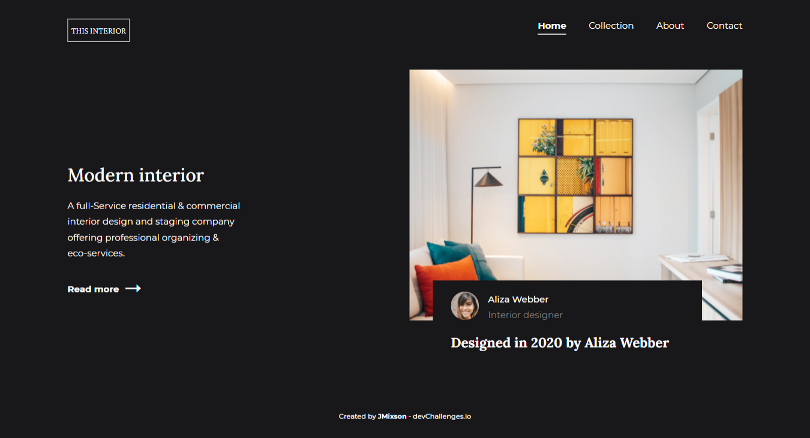
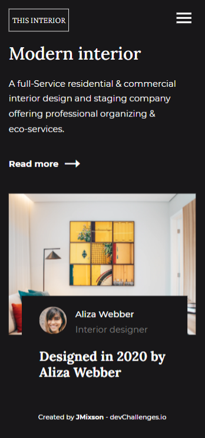

<h1 align="center">Interior Consultant</h1>

   Solution for a challenge from  <a href="http://devchallenges.io" target="_blank">Devchallenges.io</a>.

  <h3>
    <a href="https://jmixson-interior-consultant.netlify.app/">
      Demo
    </a>
     | 
    <a href="https://devchallenges.io/solutions/7gDdig5zWG4bXHHdaVUl">
      Solution
    </a>
     | 
    <a href="https://devchallenges.io/challenges/Jymh2b2FyebRTUljkNcb">
      Challenge
    </a>
  </h3>

<!-- TABLE OF CONTENTS -->

## Table of Contents

- [Overview](#overview)
  - [Built With](#built-with)
- [Resources](#resources)
- [Features](#features)
- [Acknowledgements](#acknowledgements)
- [Contact](#contact)

<!-- OVERVIEW -->

## Overview

|          Desktop Version           |          Mobile Version          |
| :--------------------------------: | :------------------------------: |
|  |  |

The main subject I improved upon was creating responsive navigation menus with added interactivity using Javascript. I also learned how to better position objects and modify SVG properties.

### Built With

- HTML
- CSS Grid & Flexbox
- [SASS](https://sass-lang.com/)
- Javascript

## Resources

- [How To Use CSS Grid Properties to Justify and Align Content and Items](https://www.digitalocean.com/community/tutorials/css-align-justify)
- [Extend &:hover of any class to any other class's hover in SASS or SCSS | Stack Overflow](https://stackoverflow.com/questions/34350513/extend-hover-of-any-class-to-any-other-classs-hover-in-sass-or-scss)
- [stroke-linecap | MDN](https://developer.mozilla.org/en-US/docs/Web/SVG/Attribute/stroke-linecap)

## Features

This application/site was created as a submission to a [DevChallenges](https://devchallenges.io/challenges) challenge. The [challenge](https://devchallenges.io/challenges/Jymh2b2FyebRTUljkNcb) was to build an application which:

- Follows the given design
- On mobile, the navigation collapses
- On mobile, the hamburger menu can be selected to see the navigation

## Acknowledgements

- [Triangle-Headed Right Arrow](https://www.toptal.com/designers/htmlarrows/arrows/triangle-headed-right-arrow/) - A website filled with symbols and their different codes to be used on the web. I used the arrow on the "Read More" button.
- [Feather - Simply beautiful open source icons](https://feathericons.com/) - A icon set available free use. I used for the icons on the mobile navigation.
- [Normalize.css](https://necolas.github.io/normalize.css/) - A CSS reset file that improves cross-browser consistency.
- [Box Sizing | CSS-Tricks](https://css-tricks.com/box-sizing/) - This article explains what the `box-sizing` property is and how to implement. I use the vendor prefixes for better sizing.

## Contact

- Website [jasminemixson.com](https://jasminemixson.com)
- GitHub [@JMixson](https://github.com/jmixson)
