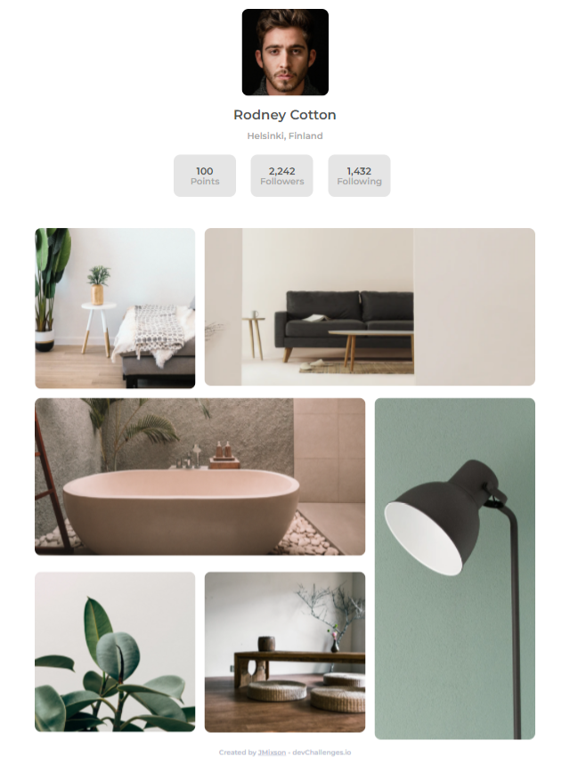
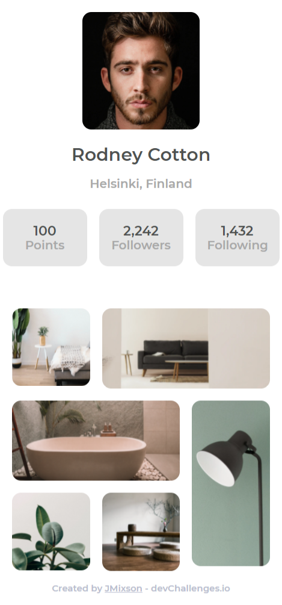

<!-- Please update value in the {}  -->

<h1 align="center">My Gallery</h1>

   Solution for a challenge from  <a href="http://devchallenges.io" target="_blank">Devchallenges.io</a>.

  <h3>
    <a href="https://jmixson-my-gallery.netlify.app/">
      Demo
    </a>
     | 
    <a href="https://{your-url-to-the-solution}">
      Solution
    </a>
     | 
    <a href="https://devchallenges.io/challenges/gcbWLxG6wdennelX7b8I">
      Challenge
    </a>
  </h3>

<!-- TABLE OF CONTENTS -->

## Table of Contents

- [Overview](#overview)
  - [Built With](#built-with)
- [Resources](#resources)
- [Features](#features)
- [Acknowledgements](#acknowledgements)
- [Contact](#contact)

<!-- OVERVIEW -->

## Overview

|          Desktop Version           |          Mobile Version          |
| :--------------------------------: | :------------------------------: |
|  |  |

For this project, I experimented with CSS Grid and its ability to span columns. I also tried using the CSS `clamp()` function to make the text and boxes scale well on different device sizes.

### Built With

- HTML
- CSS Grid & Flexbox
- [SASS](https://sass-lang.com/)

## Resources

- [clamp() | MDN](<https://developer.mozilla.org/en-US/docs/Web/CSS/clamp()>)

## Features

This application/site was created as a submission to a [DevChallenges](https://devchallenges.io/challenges) challenge. The [challenge](https://devchallenges.io/challenges/gcbWLxG6wdennelX7b8I) was to build an application which:

- Follows the given design

## Acknowledgements

- [Normalize.css](https://necolas.github.io/normalize.css/) - A CSS reset file that improves cross-browser consistency.
- [Box Sizing | CSS-Tricks](https://css-tricks.com/box-sizing/) - This article explains what the `box-sizing` property is and how to implement. I use the vendor prefixes for better sizing.

## Contact

- GitHub [@JMixson](https://github.com/jmixson)
- Website [jasminemixson.com](https://jasminemixson.com)
