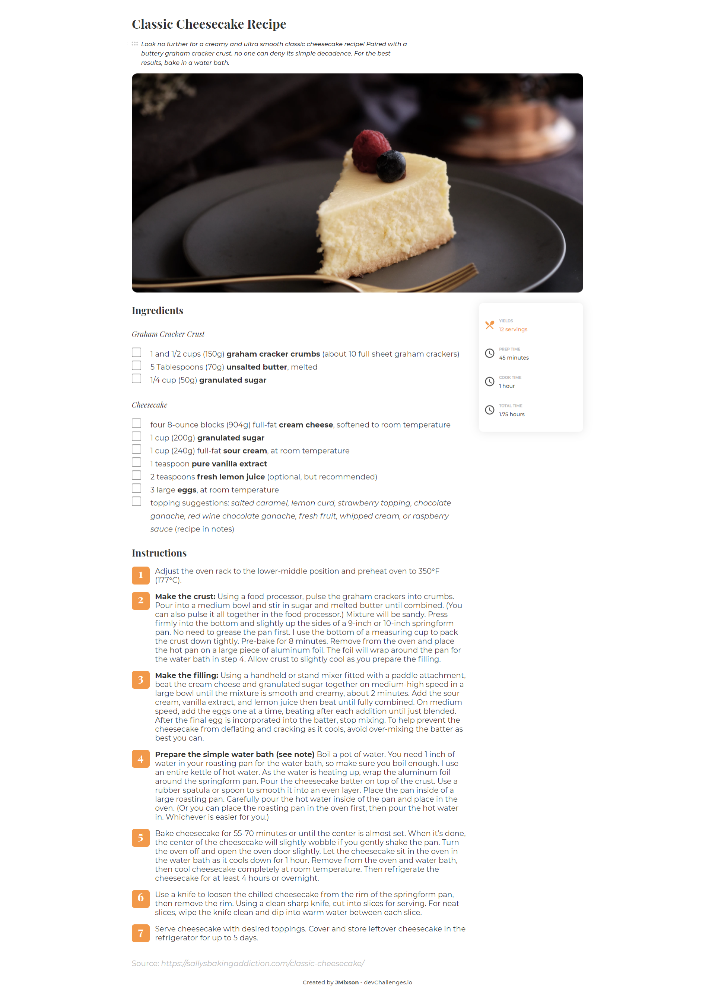
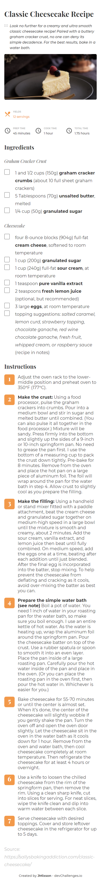

<!-- Please update value in the {}  -->

<h1 align="center">Recipe Page Solution</h1>

   Solution for a challenge from  <a href="http://devchallenges.io" target="_blank">Devchallenges.io</a>.

  <h3>
    <a href="https://jmixson-recipe-page.netlify.app/">
      Demo
    </a>
     | 
    <a href="https://devchallenges.io/solutions/gfn5BDuxdbDnLd319Y8c">
      Solution
    </a>
     | 
    <a href="https://devchallenges.io/challenges/OEKdUZ6xs0h99C38XVht">
      Challenge
    </a>
  </h3>

<!-- TABLE OF CONTENTS -->

## Table of Contents

- [Overview](#overview)
  - [Built With](#built-with)
- [Resources](#resources)
- [Features](#features)
- [Acknowledgements](#acknowledgements)
- [Contact](#contact)

<!-- OVERVIEW -->

## Overview

|          Desktop Version           |          Mobile Version          |
| :--------------------------------: | :------------------------------: |
|  |  |

I deepened my knowledge of forms, specifically with using and styling fieldsets, legends, and checkboxes. I also played with CSS grid orders and the CSS `clamp()` function.

### Built With

- HTML
- CSS Grid & Flexbox
- [SASS](https://sass-lang.com/)

## Resources

- [How to Make a Checkbox in HTML](https://blog.hubspot.com/website/html-checkbox)
- [Using the fieldset and legend elements](https://accessibility.blog.gov.uk/2016/07/22/using-the-fieldset-and-legend-elements/)
- [<input type="checkbox"> | MDN](https://developer.mozilla.org/en-US/docs/Web/HTML/Element/input/checkbox)
- [Styling forms just got easier! | Kevin Powell (YouTube)](https://www.youtube.com/watch?v=MRahw3qnRBQ&list=WL&index=9)

## Features

This application/site was created as a submission to a [DevChallenges](https://devchallenges.io/challenges) challenge. The [challenge](https://devchallenges.io/challenges/TtUjDt19eIHxNQ4n5jps) was to build an application to complete the following user stories:

- Recipe with ingredients and instructions displayed
- Checkboxes for the ingredients can be selected
- Can see the number of servings and baking times

## Acknowledgements

- [Normalize.css](https://necolas.github.io/normalize.css/) - A CSS reset file that improves cross-browser consistency.
- [Box Sizing | CSS-Tricks](https://css-tricks.com/box-sizing/) - This article explains what the `box-sizing` property is and how to implement. I use the vendor prefixes for better sizing.

## Contact

- GitHub [@JMixson](https://github.com/jmixson)
- Website [jasminemixson.com](https://jasminemixson.com)
